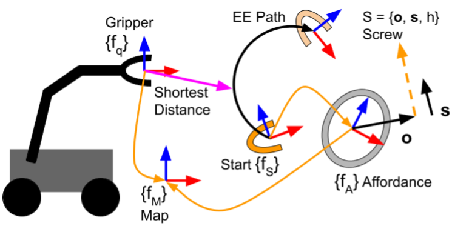

# AP Planning
This repository contains the code for pre-planning kinematic trajectories for screw-based Affordance Primitives. It depends on [affordance_primitives](https://github.com/UTNuclearRobotics/affordance_primitives), but is separated into its own repository because it has more dependecies we didn't want to include in Affordance Primitives. 

# Install
Note that this work is currently only supported for ROS Noetic.
```sh
git clone https://github.com/UTNuclearRoboticsPublic/ap_planning.git
git clone -b noetic https://github.com/UTNuclearRobotics/affordance_primitives.git
rosdep install --from-paths . --ignore-src -y
catkin build --cmake-args -DCMAKE_BUILD_TYPE=Release
```

# Examples
There are a number of examples available in the [AP Planning Examples](https://github.com/UTNuclearRoboticsPublic/ap_planning_examples) repository, please see there for information on how to install and run these examples.

# Planning Overview
See [the paper](#citation) for details of the planning algorithms. There are two methods: Sequential Path Stepping (SPS) and Direct Screw Sampling (DSS). In general, SPS is very fast and good at generating plans in uncluttered environments. DSS is slower, but better at planning around obstacles or for long, complex paths. The set up and interface for both are basically identical. 

An overview of the planning problem is shown in the figure:


The basic idea is to plan a joint trajectory that moves the EE or gripper from the start pose {fS} along the black path parameterized by a screw axis. Any given position along the path is given by a `theta` along the screw. For rotation moves, `theta` is how many radians of rotation have occurred, for translation moves `theta` is meters. The reference pose and the screw axes are the main inputs to the planners, and it is important to note that these are defined when `theta = 0`. This is important because the path is constrained by a minimum and maximum `theta`, which may be negative. In this case the reference pose {fS} is not the "starting" pose, but rather just a pose along the path (specifically the pose coorelating to `theta = 0`). 

The screw axes, min and max theta, and the reference pose are the primary inputs to the planners. The output is a joint trajectory that would move the EE link along the path. 

## Software Overview
DSS is a standalone C++ class that plans screw motions. SPS is also a C++ class, but the core components are exposed as a plugin, allowing you to customize the behavoir of the solver as needed. Neither has a ROS interface at the moment, but both follow a request-response model similar to ROS services. 

To initialize either planner, you need to pass a few things in
  - The planning group name (e.g. "panda_arm")
  - The parameter name for the robot description parameter. This is usually "/robot_description"

Additionally, the SPS has some parameters which may be set on the ROS parameter server which influence its behavoir:
  - [Required] `ik_solver_name`. This is the plugin name for the IK solver. To use the SPS default, set this to `ap_planning::IKSolver`

The default IK solver uses these optional parameters:
  - `waypoint_dist`. This is the farthest apart waypoints can be discretized too (meters). A smaller number results in more waypoints with less space between them
  - `waypoint_ang`. This is the farthest apart waypoints can be discretized too (radians). A smaller number results in more waypoints with less space between them
  - `joint_tolerance`. This is the limit for how close a joint value can vary between waypoints, and works to prevent returning solutions that contain joint reconfigurations
  - `condition_num_limit`. If a joint state has a condition number that exceeds this limit, it is disqualified as a valid state. This works to keep the manipulator away from kinematic singularity, and increasing this number allows it to get closer to singular positions.

To use each planner, simply set up the included `ap_planning::APPlanningRequest` and `ap_planning::APPlanningResponse` structs for the request and response, then call `plan()`. See the Panda demo as an example.

# Citation
This work has been published in:
```sh
TODO
```
